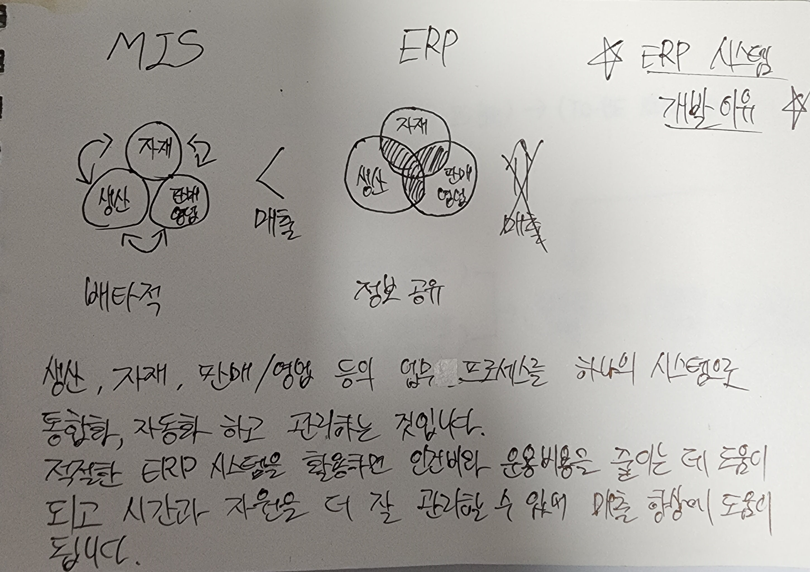
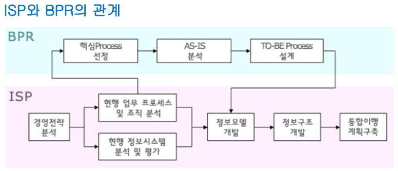

# ERP - 중간고사

## ERP 개발 이유

아웃과 소스가 합쳐져 명사화된 합성어이다.

## 중소기업 정보화와 ASP

### 아웃소싱이란

기업이 정보시스템에 대한 관리기능의 전부 또는 일부를 외부기관에 위탁하는 것이다.

### 필요성

- 핵심 사업에 집중력을 향상
- 위험요인을 분산
- 조직의 슬림화 및 유연화
- 시너지 효과에 의한 새로운 부가가치 창출
- 운영비용의 감소와 통제
- 비용의 외부화에 의한 경기변동에 대응
- 혁신효과의 가속화
- 서비스 업무의 전문성 확보
- 정보통신 네트워크의 확대
- 내부 조달이 어려운 자원의 확보

### 기대효과

- 경영의 효율화
- 외부전문성 활용
- 종합적인 경영전략

즉, 굳이 우리가 안해도 되는 일은 외부 업체에 맡겨서 경쟁력을 높이는거임.

비용 절약, 시간 활용 가능. 효율성이 높음.

### 장점

- 고비용 저효율 구조해소
- 구조 조정시 전산망 마비 위험 해소
- 업무환경 변화에 따른 신속한 대응
- 핵심적인 활동에 조직자원 집중
- 각 기술분야에서 가장 앞선 외부조직의 기술이나 경험을 활용

### 단점

- 환경변화 및 조직의 요구변화에 능동적으로 대처하기가 어려움
- 계약중단이나 파기 그리고 공급업체의 변경이 어렵고 변경시 높은 교체 비용 발생
- 과정이나 질에 대한 통제가 필요
- 데이터에 대한 보안유지에 어려움
- 협력관계 관리에 추가적 비용이 발생
- 공급 업체에 과도한 의존으로 기업의 유연성이 결여
- 내부 정보 기술력의 약화

## ISP(정보전략계획)의 도입 효과

### 1. 기업의 경영층에 주는 효과

- 경쟁 우위 확보를 지원하는 자원으로서의 정보 기술이 주는 기회를 경영층이 인식할 수 있다.
- 기업 전략 계획에 최신의 정보 기술 적용을 고려할 수 있다.
- 기업의 주요 성공요인을 체계적으로 평가할 수 있다.

### 2. 기업의 부서 관리자에게 주는 효과

- 각 부서별로 주요 성공요인을 체계적으로 평가하게 한다.
- 부서별로 목적과 문제점을 관리자가 체계적으로 파악할 수 있다.
- 최고 경영층이 조직의 목적과 방향을 수립하는데 부서 관리자의 의견이 반영될 수 있다.
- 모든 사용자가 필요로 하고 사용할 데이터를 체계적으로 분류해 준다.
- 전살실 위주의 시스템보다는 관리자나 유저 위주의 정보시스템 구축을 가능하게 한다.

### 3. 정보시스템 관리자에게 주는 효과

- 최고 경영층과 효과적인 의사전달을 할 수 있다.
- 정보시스템 관리자가 유저의 의견을 효과적으로 전달받을 수 있다.
- 정보시스템 개발과 업무활동의 관련성을 인식할 수 있다.
- 최고 경영층으로부터 시스템에 대한 이해와 지원을 받을 수 있다.
- 각 계층, 부서로부터 시스템개발의 우선 순위 합의를 도출할 수 있다.

